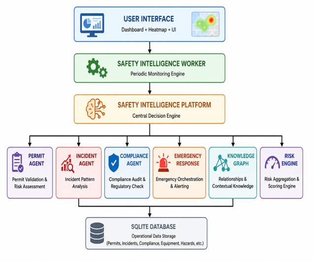
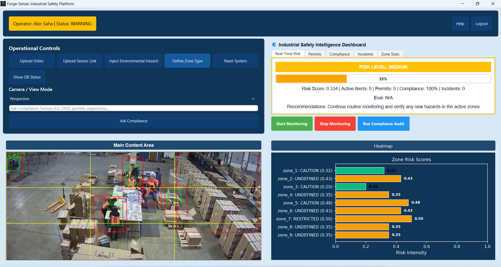

# Forge-Sense SafetyTwin

<p align="center">
<b>An AI-Powered Industrial Safety Digital Twin for Compound Risk Assessment, Permit Intelligence, Knowledge Graph Reasoning, and Emergency Response.</b>
</p>

---

## Overview

Forge-Sense SafetyTwin is an intelligent industrial safety platform that creates a **real-time Safety Digital Twin** of an industrial environment by integrating information from:

- Industrial IoT sensors
- Computer vision detections
- Permit-to-Work (PTW) systems
- Compliance records
- Historical incidents
- Safety Knowledge Graph
- Spatial risk mapping

Instead of monitoring individual safety parameters independently, Forge-Sense performs **compound risk assessment**, correlating multiple heterogeneous data sources to identify hazardous operational conditions before they escalate.

The platform is designed as a modular desktop application using **Python** and **PySide6**, enabling future integration with enterprise SCADA systems, CCTV analytics, and Industry 4.0 infrastructure.

---

# Key Features

- Industrial Safety Digital Twin
- Compound Risk Assessment
- Real-Time Risk Dashboard
- Zone-based Heatmap Visualization
- Permit Intelligence
- Historical Incident Analysis
- Compliance Monitoring
- Knowledge Graph Reasoning
- Emergency Response Orchestration
- QR-based Hazard Information Retrieval
- Evaluation Metrics Dashboard
- Modular AI Agent Architecture

---

# System Architecture

<p align="center">

</p>

Forge-Sense follows a layered architecture consisting of:

- Presentation Layer
- Worker Layer
- Safety Intelligence Platform
- AI Intelligence Modules
- Persistence Layer

---

# Dashboard

<p align="center">

</p>

The dashboard provides live operational awareness through:

- Risk Score
- Risk Level
- Heatmap Visualization
- Permit Summary
- Compliance Status
- Incident Intelligence
- Emergency Notifications
- Evaluation Metrics
- AI Recommendations

---
---

# Core Modules

## Safety Intelligence Platform

Central orchestration engine responsible for

- Compound Risk Assessment
- Agent Coordination
- Recommendation Generation
- Emergency Decision Support

---

## Permit Intelligence

- Permit validation
- SIMOPS detection
- Permit risk scoring
- Sensor correlation

---

## Incident Intelligence

- Historical incident analysis
- Near-miss pattern mining
- Repeat hazard identification
- Trend analysis

---

## Compliance Monitor

Evaluates industrial operations against

- Factory Act
- OISD
- DGFASLI

Provides

- Compliance status
- Violations
- Recommendations

---

## Emergency Response

Supports

- Hazard escalation
- Emergency alerts
- Evidence preservation
- Incident logging

---

## Safety Knowledge Graph

Models relationships between

- Equipment
- Hazards
- Locations
- Workers
- Permits
- Historical incidents

to enable contextual safety reasoning.

---

## QR-based Information Retrieval

Each detected hazard or monitored zone can be associated with a QR code that provides contextual operational information, including:

- Active permits
- Equipment details
- Hazard history
- Applicable safety guidelines
- Emergency procedures

This enables rapid access to safety information directly from the operational environment.

---

# Compound Risk Assessment

Forge-Sense correlates multiple safety indicators instead of relying on isolated thresholds.

### Inputs

- Environmental Sensors
- Permit Status
- Incident History
- Compliance Records
- Knowledge Graph Context
- Computer Vision Events

### Outputs

- Composite Risk Score
- Risk Category
- AI Recommendations
- Emergency Actions

---

# Technology Stack

| Category | Technology |
|-----------|------------|
| Language | Python |
| GUI | PySide6 |
| Database | SQLite |
| Computer Vision | YOLOv8 + OpenCV |
| AI | Rule-based Safety Intelligence |
| Knowledge Graph | NetworkX |
| Visualization | Qt Widgets |
| Reporting | ReportLab |
| OCR | EasyOCR |

---

# Project Structure

```text
Forge-Sense
│
├── safetwin
│   ├── core
│   ├── services
│   ├── ui
│   ├── model
│   ├── database
│   └── app.py
│
├── docs
│   └── images
│
├── tests
│
├── requirements.txt
└── README.md
```

---

# Evaluation Framework

The platform evaluates operational performance using

- False Negative Rate (FNR)
- Lead Time
- Geospatial Quality

Historical metrics become available as operational data accumulates.

---

# Current Implementation

### Implemented

- Safety Digital Twin
- Compound Risk Engine
- Interactive Dashboard
- Heatmap Visualization
- Permit Intelligence
- Incident Analysis
- Compliance Monitoring
- Knowledge Graph
- QR Information Retrieval
- Emergency Response
- Evaluation Metrics

### Planned

- Live SCADA Integration
- Industrial IoT Deployment
- Multi-camera Vision Analytics
- Worker Localization
- Predictive Machine Learning
- Enterprise Digital Twin Expansion

---

# Installation

Clone the repository

```bash
git clone https://github.com/<username>/Forge-Sense.git
```

Install dependencies

```bash
pip install -r requirements.txt
```

Launch Forge-Sense

```bash
python -m safetwin.app
```

---

# Future Roadmap

- Industrial SCADA Integration
- Live PLC Connectivity
- Worker Localization (RTLS/UWB)
- Predictive Risk Forecasting
- RAG-powered Compliance Intelligence
- Enterprise-scale Digital Twin
- Multi-facility Monitoring
- Advanced Hazard Simulation

---

# Author

**Abir Saha**

B.Tech Computer Science & Engineering

RCC Institute of Information Technology

Industrial AI • Computer Vision • Digital Twins • Intelligent Safety Systems

---

# License

This project is released for academic research, industrial demonstrations and use.

---

# Acknowledgements

Forge-Sense draws inspiration from Industry 4.0, Industrial Digital Twins, AI-driven Safety Intelligence, and Predictive Risk Management frameworks.
